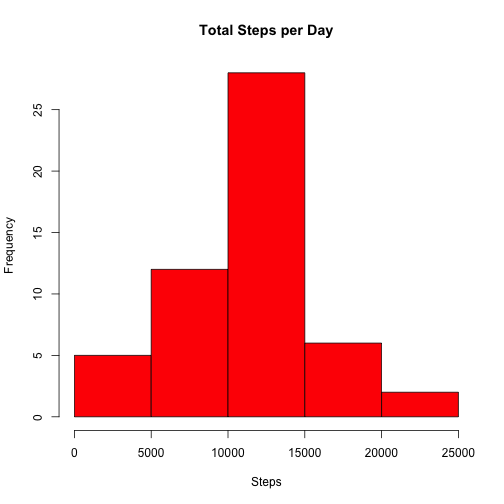
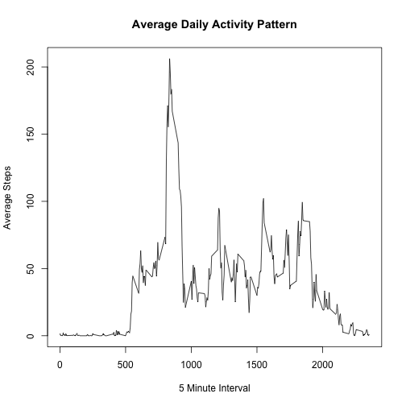
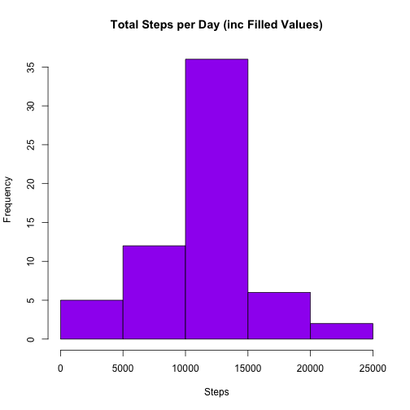
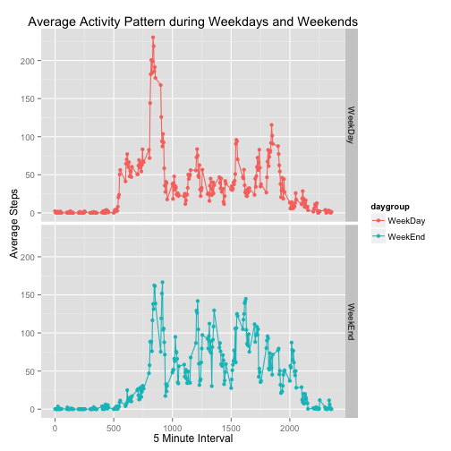

## Loading and preprocessing the data
Read main data set

```r
data <- read.csv("activity.csv", sep=",", na.strings="NA")
head(data)
```

```
##   steps       date interval
## 1    NA 2012-10-01        0
## 2    NA 2012-10-01        5
## 3    NA 2012-10-01       10
## 4    NA 2012-10-01       15
## 5    NA 2012-10-01       20
## 6    NA 2012-10-01       25
```

Create Total Steps per day aggregate dataset

```r
data_day <- setNames(
                aggregate(data$steps, by=list(date=data$date), FUN=sum)
                ,c("date","steps")
                )
head(data_day)
```

```
##         date steps
## 1 2012-10-01    NA
## 2 2012-10-02   126
## 3 2012-10-03 11352
## 4 2012-10-04 12116
## 5 2012-10-05 13294
## 6 2012-10-06 15420
```

Create Average Steps per interval aggregate dataset

```r
data_interval <- setNames(
        aggregate(data$steps, by=list(interval=data$interval), FUN=mean, na.rm=TRUE)
        ,c("interval","steps")
)
head(data_interval)
```

```
##   interval     steps
## 1        0 1.7169811
## 2        5 0.3396226
## 3       10 0.1320755
## 4       15 0.1509434
## 5       20 0.0754717
## 6       25 2.0943396
```

## What is mean total number of steps taken per day?

```r
hist(data_day$steps
     ,col = "red"
     ,main = "Total Steps per Day"
     ,xlab = "Steps"
     )
```

 

Calculate and report the mean and median of the total number of steps taken per day:

```r
mean(data_day$steps, na.rm=TRUE)
```

```
## [1] 10766.19
```

```r
median(data_day$steps, na.rm=TRUE)
```

```
## [1] 10765
```

## What is the average daily activity pattern?
Make a time series plot (i.e. type = "l") of the 5-minute interval (x-axis) and the average number of steps taken, averaged across all days (y-axis)

```r
with(data_interval, 
     plot(interval, steps
          ,type = "l"
          ,main = "Average Daily Activity Pattern"
          ,xlab = "5 Minute Interval"
          ,ylab = "Average Steps"
     )
)
```

 

Which 5-minute interval, on average across all the days in the dataset, contains the maximum number of steps?

```r
subset(data_interval,steps==max(data_interval$steps))
```

```
##     interval    steps
## 104      835 206.1698
```

## Imputing missing values
Calculate and report the total number of missing values in the dataset (i.e. the total number of rows with NAs):

```r
sum(is.na(data$steps))
```

```
## [1] 2304
```

Create new dataset and fill missing values with average for that 5 minute interval:

```r
data_filled <- data
data_filled[is.na(data_filled[,1]), 1] <- data_interval[match(data_filled[is.na(data_filled[,1]), 3], data_interval$interval),"steps"]
head(data_filled)
```

```
##       steps       date interval
## 1 1.7169811 2012-10-01        0
## 2 0.3396226 2012-10-01        5
## 3 0.1320755 2012-10-01       10
## 4 0.1509434 2012-10-01       15
## 5 0.0754717 2012-10-01       20
## 6 2.0943396 2012-10-01       25
```

```r
sum(is.na(data_filled$steps))
```

```
## [1] 0
```

Create Total Steps per day aggregate dataset including filled values and plot histogram:

```r
data_filled_day <- setNames(
                aggregate(data_filled$steps, by=list(date=data_filled$date), FUN=sum)
                ,c("date","steps")
                )
head(data_filled_day)
```

```
##         date    steps
## 1 2012-10-01 10766.19
## 2 2012-10-02   126.00
## 3 2012-10-03 11352.00
## 4 2012-10-04 12116.00
## 5 2012-10-05 13294.00
## 6 2012-10-06 15420.00
```

```r
hist(data_filled_day$steps
     ,col = "purple"
     ,main = "Total Steps per Day (inc Filled Values)"
     ,xlab = "Steps"
     )
```

 

Calculate and report the mean and median total number of steps taken per day.

```r
mean(data_filled_day$steps)
```

```
## [1] 10766.19
```

```r
median(data_filled_day$steps)
```

```
## [1] 10766.19
```

Do these values differ from the estimates from the first part of the assignment?

```r
mean(data_filled_day$steps) - mean(data_day$steps, na.rm=TRUE)
```

```
## [1] 0
```

```r
median(data_filled_day$steps) - median(data_day$steps, na.rm=TRUE)
```

```
## [1] 1.188679
```

What is the impact of imputing missing data on the estimates of the total daily number of steps?

```r
sum(data_filled$steps) - sum(data$steps, na.rm=TRUE)
```

```
## [1] 86129.51
```

## Are there differences in activity patterns between weekdays and weekends?
Create a new factor variable in the dataset with two levels – “weekday” and “weekend” indicating whether a given date is a weekday or weekend day.

```r
data_filled <- cbind(data_filled, day=weekdays(as.Date(data_filled[,2], "%Y-%m-%d")))
weekend <- c('Saturday', 'Sunday')
data_filled <- cbind(data_filled, daygroup=factor((data_filled$day %in% weekend), levels=c(FALSE, TRUE), labels=c('WeekDay', 'WeekEnd')))
head(data_filled)
```

```
##       steps       date interval    day daygroup
## 1 1.7169811 2012-10-01        0 Monday  WeekDay
## 2 0.3396226 2012-10-01        5 Monday  WeekDay
## 3 0.1320755 2012-10-01       10 Monday  WeekDay
## 4 0.1509434 2012-10-01       15 Monday  WeekDay
## 5 0.0754717 2012-10-01       20 Monday  WeekDay
## 6 2.0943396 2012-10-01       25 Monday  WeekDay
```

```r
data_filled_interval <- setNames(
        aggregate(data_filled$steps, by=list(daygroup=data_filled$daygroup, interval=data_filled$interval), FUN=mean, na.rm=TRUE)
        ,c("daygroup","interval","steps")
)
head(data_filled_interval)
```

```
##   daygroup interval      steps
## 1  WeekDay        0 2.25115304
## 2  WeekEnd        0 0.21462264
## 3  WeekDay        5 0.44528302
## 4  WeekEnd        5 0.04245283
## 5  WeekDay       10 0.17316562
## 6  WeekEnd       10 0.01650943
```


```r
require(ggplot2)
g <- qplot(interval,steps,data = data_filled_interval,color = daygroup, facets = daygroup ~ .)  + labs(title="Average Activity Pattern during Weekdays and Weekends",x = "5 Minute Interval",y = "Average Steps")
g + geom_line()
```

 

Yes, weekday activity patterns differ to weekend ones.
